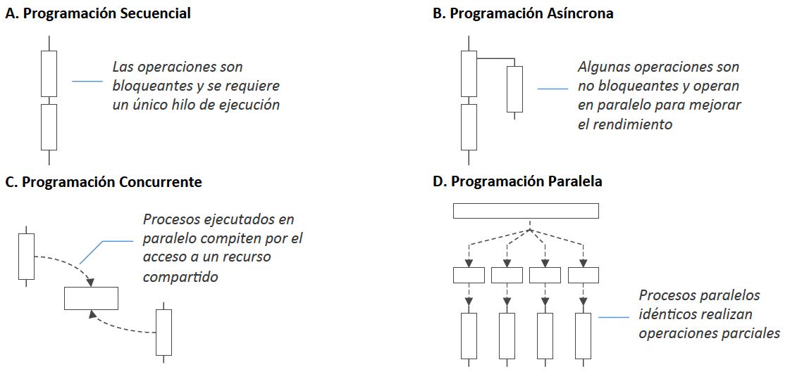
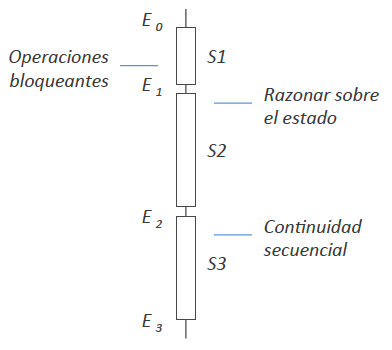
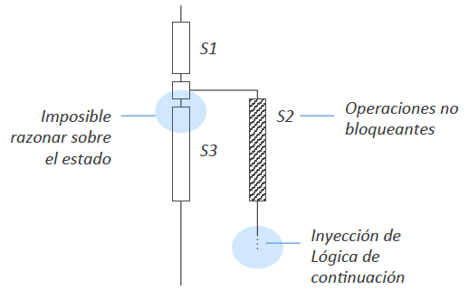
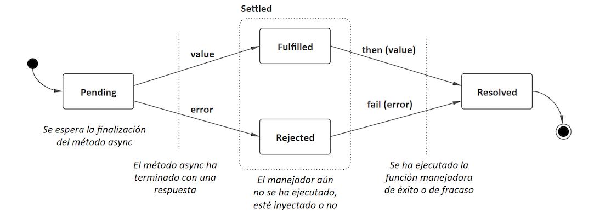
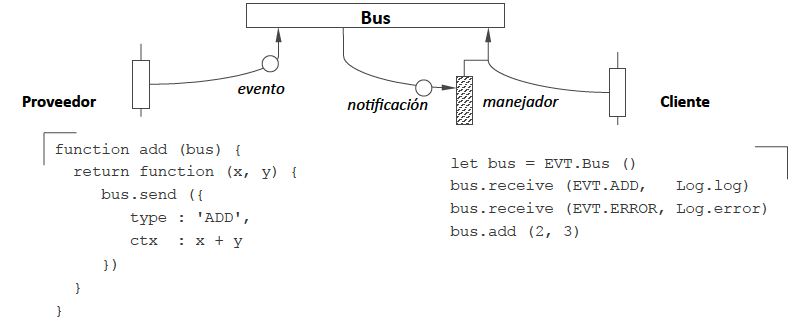
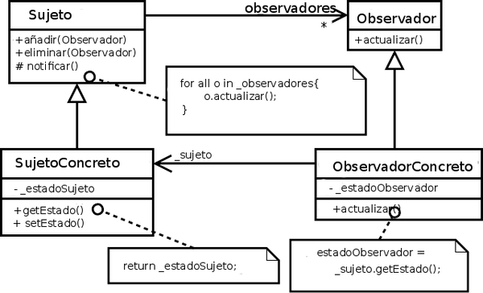
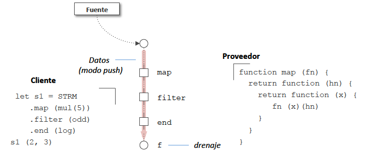

<!-- size: 16:9 -->
<!-- theme: default -->

<!-- paginate: false -->

<style>
h1 {
  text-align: center;
}
h2 {
  color: darkblue;
  text-align: center;
}
</style>

# PROGRAMACIÓN ASÍNCRONA

---

## Operaciones bloqueantes vs no bloqueantes

La programación asíncrona...

- promueve la definición de operaciones **no bloqueantes**
- busca mecanismos que simulen la secuencialidad algorítmica a la vez que se mantiene el carácter no bloqueante de las operaciones
- suele llevarse bien con la FP, no tan bien con la OOP

---

## Modelos de ejecución



---

## Estado y continuación

Las funciones no bloqueantes afectan a:

- El **estado** del programa
- La lógica de **continuación** del programa

Esto complica notablemente el razonamiento y la operativa algorítmica habitual

---

programación secuencial   |  programación asíncrona
:-------------------------:|:-------------------------:
 | 

---

¿Qué problemas hay que resolver en programación asíncrona?


---

## Modelos de paso de continuaciones

Aumentar la aridad de la función no bloqueante en 1 argumento adicional (la función de **retrollamada**), donde se indica la lógica de continuación.


- El comportamiento del cliente _llamador_ puede especificarse con un _listener_ o manejador de eventos
- La lógica de continuación se puede indicar mediante una retrollamada o _callback_

---
<!-- paginate: true -->

<style scoped>
p {
  text-align: center;
}
</style>

## Listeners

---

### Manejo de eventos

Un _listener_ o _event handler_ es una subrutina para manejar retrollamadas (_callbacks_) que gestiona la entrada recibida como respuesta a un evento generado por el framework/sistema operativo para el que está preparado un programa.

- Los eventos pueden representar acciones de usuario, vencimiento de temporizadores, disponibilidad de mensajes o datos, etc.
- El framework puede ser parte del sistema operativo, del entorno de programación, de una máquina virtual, etc.
- En OOP se implementan como **observers**; En FP, se implementan como lambdas.

---

### Ejemplo de listener con y sin lambdas

```java
import java.awt.*;
import java.awt.event.*;
import javax.swing.*;

/**
 * This simple Swing program demonstrates how to use Lambda expressions in
 * action listener.
 *
 * @author www.codejava.net
 */
public class ListenerLambdaExample extends JFrame {

    private JButton button = new JButton("Click Me!");

    public ListenerLambdaExample() {
        super("Listener Lambda Example");

        getContentPane().setLayout(new FlowLayout());
        getContentPane().add(button);

        // Java 7 - tradicional, sin lambdas
        button.addActionListener(new ActionListener() {
            public void actionPerformed(ActionEvent evt) {
                System.out.println("Handled by anonymous class listener");
            }
        });
```

---

```java
        // Java 8 - con lambdas
        button.addActionListener(e -> System.out.println("Handled by Lambda listener"));

        button.addActionListener(e -> {
            System.out.println("Handled Lambda listener");
        });

        setDefaultCloseOperation(JFrame.EXIT_ON_CLOSE);
        setSize(300, 100);
        setLocationRelativeTo(null);
    }

    public static void main(String[] args) {
        SwingUtilities.invokeLater(new Runnable() {
            public void run() {
                new ListenerLambdaExample().setVisible(true);
            }
        });
    }
}
```

---

## Callbacks

---

### Retrollamada

Una retrollamada es cualquier referencia a un trozo de código ejecutable (función) que se pasa como argumento a otro trozo de código (función). Se espera que esta segunda función vuelva a llamar (call back) a la primera como parte de su tarea.

__Ejemplos__: Diversas implementaciones de _listeners_ + _callbacks_

- Clases anónimas
- Expresiones lambda
- Punteros a función
- Etc.

<!--
---

### Ejemplo: Ajax + jQuery callbacks

- [Ajax](http://learn.jquery.com/ajax/)
- [jQuery](http://devdocs.io/jquery/)
- [jQuery Callbacks object](http://devdocs.io/jquery-callbacks-object/)

-->

---

### Ejemplo: callbacks en Javascript

**Versión síncrona**:

```javascript
// Versión síncrona
function main() {
    r1 = serv1("datos iniciales");
    r2 = serv2(r1);
    // También se podría haber escrito:
    //   r2 = serv2(serv1("datos iniciales"))
    console.log("Resultado final: { " + r2 + " }");
}

function serv1(parametros) {
    return "Tardo en calcular r1 a partir de { " + parametros + " }";
}

function serv2(resultado1) {
    return "Tardo en calcular r2 a partir de { " + resultado1 + " }";
}
```

---

**Versión asíncrona con _callbacks_:**

```javascript
// Versión asíncrona.
// Las funciones asinc1() y asinc2() admiten un callback
// como segundo parámetro, al cual llamarán pasándole el resultado del cómputo
function main() {
    asinc1("datos iniciales", function(r1){
        // Aquí tenemos el resultado de asinc1
        asinc2(r1, function(r2) {
            console.log("Resultado final: { " + r2 + " }");
        });
    });
}

function asinc1(parametros, callback) {
    r1 = "Tardo en calcular r1 a partir de { " + parametros + " }";
    callback(r1);
}

function asinc2(resultado1, callback) {
    r2 = "Tardo en calcular r2 a partir de { " + resultado1 + " }";
    callback(r2);
}
```

---

##### _Callback hell_:

El uso de callbacks hace el código complejo, repetitivo y difícil de entender, especialmente cuando el tamaño del código crece.

- La anidación empeora si se necesita el resultado de una función para llamar a otra: funciones que son parámetros de otras funciones, que son parámetros de otras, etc.
- El código fuente se va indentando más y más para luego ir deshaciendo esa indentación a medida que se cierran llaves y paréntesis.
- La lógica está escrita al revés: las funciones no devuelven resultados, sino que pasan esos resultados como parámetros a otras funciones; las funciones que manejan la respuesta son también pasadas como parámetros
- El flujo de gestión de errores también se complica y [no pueden usarse excepciones](https://basarat.gitbook.io/typescript/future-javascript/promise#callback-style-code).

---

## Promesas y Futuros

---

### Modelo de promesas y futuros

[Futuros y promesas](https://en.wikipedia.org/wiki/Futures_and_promises) en wikipedia

- **Futuro**: marcador de posición (_placeholder_), de solo lectura, para una variable que representa el resultado de un cómputo asíncrono
- **Promesa**: contenedor de una asignación escribible (solo para inicialización), que fija el valor de un _futuro_.

Los futuros y promesas sirven para desacoplar un valor (el futuro) de cómo éste se calculó (la promesa), permitiendo así la paralelización de los cálculos.

---

## Futuros

---

### Futuros en Java

En Java hay definida una interfaz explícita para los futuros:

- Desde Java 5: [`java.util.concurrent.Future`](https://docs.oracle.com/javase/9/docs/api/java/util/concurrent/Future.html) 
- Se pueden encadenar cálculos usando futuros __computables__ o __escuchables__, que sirven para indicar a un __thread__ que ejecute una determinada tarea y, cuando termine, se dirija a hacer otra tarea usando el resultado de la tarea anterior.
  - En Guava: [`ListenableFuture`](https://github.com/google/guava/wiki/ListenableFutureExplained)
  - Desde Java 8 (inspirado por Guava): [`java.util.concurrent.CompletableFuture`](https://docs.oracle.com/javase/9/docs/api/java/util/concurrent/CompletableFuture.html)

Un `CompletableFuture` es un futuro que debe completarse explícitamente (i.e. fijar su valor y su estado) y puede servir para dar soporte a otras funciones y acciones dependientes, que se disparan tras su compleción.

---

**Ejemplo: `Future` en Java**

```java
import java.util.concurrent.*;

public class Main {
    // Callable<V> = Interfaz funcional que representa a una operación sin args
    // y que devuelve un resultado de tipo V (permite checked exceptions)
    public static class MyCallable implements Callable<Integer> {
        @Override
        public Integer call() throws Exception {
            Thread.sleep(1000);
            return 1;
        }
    }

    public static void main(String[] args) throws Exception{
        ExecutorService exec = Executors.newSingleThreadExecutor();
        Future<Integer> f = exec.submit(new MyCallable());
        System.out.println(f.isDone()); //Falso
        System.out.println(f.get()); //Espera hasta que termine la tarea, luego imprime
    }
}
```

---

**Ejemplo: `CompletableFuture` en Java**

```java
import java.util.concurrent.*;
import java.util.function.*;

public class Main {

    // Supplier<T> = Interfaz funcional que representa a una operación sin args y que 
    // devuelve un resultado de tipo T (no permite checked exceptions)

    public static class MySupplier implements Supplier<Integer> {
        @Override
        public Integer get() {
            try {
                Thread.sleep(1000);
            } catch (InterruptedException e) {
                //No hacer nada
            }
            return 1;
        }
    }
```

---

```java
    public static class PlusOne implements Function<Integer, Integer> {
        @Override
        public Integer apply(Integer x) {
            return x + 1;
        }
    }

    public static void main(String[] args) throws Exception {
        ExecutorService exec = Executors.newSingleThreadExecutor();
        CompletableFuture<Integer> f = CompletableFuture.supplyAsync(
                                          new MySupplier(), exec);
        System.out.println(f.isDone()); // Falso
        CompletableFuture<Integer> f2 = f.thenApply(new PlusOne());
        System.out.println(f2.get()); // Espera hasta que termine el cálculo, luego imprime
    }
}    
```

---

## Promesas

---

### Modelo de promesas


---

El cliente recibe como respuesta inmediata una __abstracción de datos__ (la `Promise`) que representa un compromiso de valor futuro, con __inyectores__ (`then`, `catch`) para incluir la __lógica de continuación__.

Las promesas se pueden __resolver__ (_resolve_) o __rechazar__ (_reject_)

---

### Funcionamiento de una promesa



---

### Promesas en Javascript

```javascript
const promise = new Promise((resolve, reject) => {
    // las funciones resolve/reject controlan el destino de la promesa
});
```

---

**Ejemplo con promesas**:

```javascript
// Versión con promesas
// Ahora asinc1 y asinc2 se supone que devuelven una promesa (que solo resuelve)
function main() {
    asinc1("datos iniciales")
    .then(function(r1){ return asinc2(r1); })
    .then(function(r2){
        console.log("Resultado final: " + r2); 
    }).catch(function(err){
        console.log("Error: "+ err.message)
    });
}
```

---

```javascript
// Lo anterior puede escribirse más conciso:
function main() {
    asinc1("datos iniciales")
    .then(asinc2)
    .then(function(r2){
        console.log("Resultado final: " + r2); 
    }).catch(function(err){
        console.log("Error: "+ err.message)
    });
}

function asinc1(parametros) {
    return new Promise((resolve, reject) => {
        resolve("Tardo en calcular r1 a partir de { " + parametros + " }");
    });
}

function asinc2(resultado1) {
    return new Promise((resolve, reject) => {
        resolve("Tardo en calcular r2 a partir de { " + resultado1 + " }");
    });
}
```

---

```javascript
// Si asinc2 devolviera un error
function asinc2(resultado1) {
    return new Promise((resolve, reject) => {
        reject( new Error("Ha habido un error al calcular r2 a partir de { "
                     + resultado1 + " }"));
    });
}
```

__Salida__:

`Error: Ha habido un error al calcular r2 a partir de { Tardo en calcular r1 a partir de { datos iniciales } }`

---

```javascript
// Si asinc1 devolviera un error
function asinc1(parametros) {
    return new Promise((resolve, reject) => {
        reject( new Error("Ha habido un error al calcular r1 a partir de { "
                       + parametros + " }"));
    });
}
```

__Salida__:

`Error: Ha habido un error al calcular r1 a partir de { datos iniciales }`

---

**Solución al _callback hell_**:

- Las promesas evitan la anidación y hacen más simple el manejo de errores.
- La ventaja de las promesas es que se pueden [encadenar](https://basarat.gitbook.io/typescript/future-javascript/promise#chain-ability-of-promises).

---

**Inyectores:**

- Una promesa tiene un método `then()` que...

  - recibe una __función__, que será ejecutada automáticamente cuando la promesa se resuelva. Dicha función recibirá como parámetro el valor de la promesa (el resultado esperado).
  - devuelve una __nueva promesa__, que se resolverá cuando se ejecute la función que le habíamos asociado.

- Se pueden encadenar varios `.then()` para simular un código secuencial, conforme se van resolviendo promesas.

---

**Inyectores:**

- Una promesa tiene un método `catch()` que:

  - recibe una __función__, que será ejecutada automáticamente cuando la promesa se rechace. 
  - devuelve una __nueva promesa__, creando una cadena de promesas

- Se puede agregar la gestión de errores de cualquier parte de la cadena de llamadas asíncronas con un solo `.catch()`
- Cualquier error síncrono generado en un `then` o un `catch` hace que la promesa se rechace, y se llame al `catch` más apropiado

---

### Sintaxis async/await

- El prefijo `await` hace que se espere a que se llame a la función asíncrona antes de continuar con la ejecución del programa.
- Esto genera un flujo de ejecución de la lógica del programa más fácil de leer y de seguir, pausando la ejecución hasta que se cumpla la promesa.

`async`/`await` es azúcar sintáctico para usar promesas con una nueva sintaxis que las oculta y las hace parecer código síncrono:

  - Un `await` delante de una llamada a función entiende que esa función devuelve una promesa.
  - La ejecución se pausa y sólo se reanuda cuando la promesa se haya resuelto.
  - Entonces `await` devuelve como resultado el valor de la promesa.

---

**Ejemplo con async/await en Javascript**

```javascript
async function main() {
    r1 = await asinc1("datos iniciales");
    r2 = await asinc2(r1);
    console.log("Resultado final: { " + r2 + " }");
}
```

Comparar la versión asíncrona async/await con la versión síncrona inicial:

```javascript
function main() {
    r1 = serv1("datos iniciales");
    r2 = serv2(r1);
    console.log("Resultado final: { " + r2 + " }");
}
```

---

## Eventos

---

### Modelo de eventos

Las operaciones disparan eventos de diferentes tipos, que son escuchados por los manejadores (_listeners_) de eventos, que habrán sido registrados previamente en un bus de eventos.




---

**Ventajas**:

- Aplicaciones más interactivas
- Mejor uso de los recursos

### Estrategias

Estrategias para escribir aplicaciones basadas en eventos:

1. Máquinas de estados finitos (FSM)
2. Implementaciones del patrón _Observer_
3. Sistemas de publicación/suscripción (PubSub)
4. Streams y programación reactiva

---

### 1. Máquinas de estados

Una FSM es una especificación de cómo manejar eventos


---

### 2. Patrón Observer

- **Observable**: fuente de eventos
- **Observadores**: lista de clientes interesados en los eventos

Los observadores se registran ellos mismos en cada observable $\Rightarrow$ produce acoplamiento.

Las acciones de callback son gestionadas por los observables, que suele mantener una lista interna de observadores $\Rightarrow$ produce cuellos de botella.

---

__Estructura del patrón Observer:__




---

__Comportamiento del patrón Observer:__


---

### 3. PubSub

- Los sistemas de _PubSub_ son _observers_ generalizados
- Los publicadores y los suscriptores se conectan por **canales** o **colas**
- Suelen implementarse en bibliotecas de mensajería o _**Message Queues**_ (MQ)
- Cada **canal** tiene un nombre, empleado por publicadores y sucriptores para desacoplarse entre sí
- La comunicación puede hacerse asíncrona

---

__Ejemplos de bibliotecas de PubSub/MQ:__

- RabbitMQ
- ZeroMQ
- NATS
- Apache ActiveMQ
- etc.

__Protocolos de MQ:__

- AMQP
- MQTT
- STOMP
- etc.

---

¿Cómo crear sistemas que respondan a combinaciones de eventos?
Hay que añadir la dimensión del __tiempo__ al procesamiento de los eventos

Los eventos deben disparar reacciones en el código, pero no es fácil conectar las acciones con los eventos. Para facilitarlo, se usan _streams_...

---

### 4. Streams y Rx

Los datos fluyen por pipelines y se consumen siguiendo modelos _push_ o _pull_



Un stream trata a los eventos como colleciones de datos, de forma que pueden ser tratados como cualquier otra colección: manipularlos, combinarlos, filtrarlos, etc.

Además, los streams pueden ser asíncronos.

---

### Programación reactiva (Rx)

Es un paradigma, parte de la programación asíncrona: la disponibilidad de información nueva conduce la lógica del programa, en vez de dejar que el control de flujo sea dirigido por un hilo de ejecución.

- Modelo de **Observables**: tratar a los streams de eventos asíncronos con las mismas operaciones sencillas de composición que se usan para las colecciones de datos.
- Bibliotecas de programación Rx: [reactivex.io](http://reactivex.io/)
- [Principios](http://reactivex.io/intro.html) de la programación reactiva

---

#### Observables

Los Observables se pueden:

- Crear: `Create`, `Defer`, `From`, `Interval`, `Just`, `Range`, `Repeat`, `Start`, `Timer`
- Transformar: `Buffer`, `FlatMap`, `GroupBy`, `Map`, `Scan`, `Window`
- Filtrar: `Debounce`, `Distinct`, `ElementAt`, `Filter`, `IgnoreElements`, `Last`, `Sample`, `Skip`, `SkipLast`, `Take`, `TakeLast`
- Combinar: `And`/`Then`/`When`, `CombineLatest`, `Join`, `Merge`, `StartWith`, `Switch`, `Zip`
- Etc... [Operadores Rx](http://reactivex.io/documentation/operators.html)

---

> LECTURA recomendada: [The introduction to Reactive Programming you've been missing (by @andrestaltz)](https://gist.github.com/staltz/868e7e9bc2a7b8c1f754)

---

¿Qué añade un Observable al patrón Observer?

Añade a un __Observer asíncrono__ la semántica de un __Iterable síncrono__:

- `onCompleted()`: para que el publicador avise al suscriptor que no hay más datos disponibles en el stream (los Iterables simplemente acaban su iteración)
- `onError()`: para que el productor avise al suscriptor que ha ocurrido un error (en su lugar, los Iterables elevan excepciones)
 
---

#### Ejemplos de frameworks de streams

- Apache Kafka
- NATS Streaming
- Spark Streaming
- Amazon Kinesis
- Apache Pulsar
- Etc.
  
---

__Lecturas recomendadas__

- Thomas & Hunt. The Pragmatic Programmer, 2nd edition, 2022. Capítulo: *Transforming Programming*
- [How to Write Clean Codes by Using Pipe Operations in Python?](https://www.turing.com/kb/write-clean-codes-by-using-pipe-operations-in-python)
